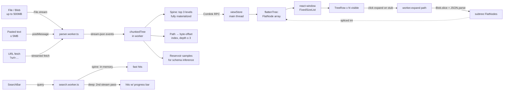
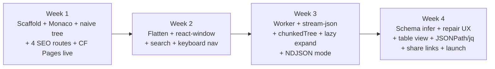

# Month 1 Implementation Plan — JSON Tool (v2)

> **Changes from v1:** NDJSON support added in W3 · JSONPath/jq query language in M1 · table view added in W4 · SEO landings cut from 8 to 4 with deep content · cold-email experiment reframed to test persona overlap · share-links privacy UX fixed · `?url=` cap aligned with hero claim · KV value limits flagged · launch channel sequence expanded beyond HN · benchmark video budget doubled · PWA in Done criteria · email-capture value exchange designed · trademark search added to brand decision · benchmark methodology to be published.

## Context

Building the **free public JSON tool** that serves as the acquisition funnel for a paid SaaS ("reliability + observability for structured data," LLM JSON reliability as the entry wedge). 90-day company goal is 10 paying teams; Month 1's goal is a live public URL with the **huge-JSON wedge feature** working end-to-end and SEO routes indexed.

**Three locked differentiators:**

1. Huge-JSON handling (including NDJSON) — *Month 1 wedge*
2. Semantic diff — Month 2
3. AI grounded explanations + schema inference — schema inference Month 1, AI Month 2

**Open strategic question (must resolve in M1):** the free-tool wedge (huge JSON, serving data engineers/SREs) and the paid-tier wedge (LLM JSON reliability, serving AI engineers) target different personas. The cold-email experiment in W1 is now scoped to measure overlap; if it's under 10%, the funnel needs rethinking before M2. This is the single load-bearing risk in the 90-day plan.

**Out of scope for Month 1:** auth/accounts, paid tier UI, semantic diff, AI explanations, NL→jq, native desktop, VSCode extension, real-time collab, mobile optimization. Week 4 slack goes to perf grinding, not features.

---

## Architecture — huge-JSON path (the load-bearing piece)



**Memory rule — never violate:** never materialize a 500MB JSON to a single JS object. Spine + offset index only.

**Index size budget:** index stays <50MB on 1GB input by capping at depth 3 and array-offset granularity (every Nth element for huge arrays).

**Offset safety:** byte offsets stored in the index must land on structural token boundaries (between tokens), never inside a string or number. Snap offsets to nearest structural boundary at index-build time.

**NDJSON detection:** on file load, sample first 4KB. If content matches `^(\{.*\}|\[.*\]|".*"|[\d\-tfn])\n` repeated, treat as NDJSON. Build line-offset index (byte position of each newline) instead of structural offset index. Each line is a separate document; tree view paginates by line range (default 1000 lines/page). Lazy expand a single line = `Blob.slice(lineStart, lineEnd) → JSON.parse`. Same architecture, simpler subproblem.

**Known future scaling risk — `FlatNode[]` memory growth:** the flat array indexed by `react-window` is a single linear buffer. Cap visible-expanded children at ~100k with a "show more" stub. Month 2+ likely needs segmented flat buffers.

---

## Week dependency shape



Day-1 spike already done (2026-05-14): `@streamparser/json` selected.

---

## Locked stack

| Layer | Choice | Reason |
|---|---|---|
| Framework | **Vite + React 18 + TS** | Better workers/WASM/Monaco story than Next.js |
| Routing | **react-router v6 (data router)** | Strong SSG ecosystem |
| SSG | **`vite-react-ssg`** | Prerenders SEO routes to static HTML at build time |
| Styling | **Tailwind + shadcn/ui + Radix** | Matches existing repo patterns |
| State | **Zustand + Immer** | Lightweight; workers can subscribe |
| Editor | **Monaco** via `@monaco-editor/react` | Lazy-loaded; not on SEO routes |
| Virtualization | **react-window `FixedSizeList`** over flat array | Simpler than VariableSizeList |
| Streaming parser | **`@streamparser/json`** in web worker | Locked via Day-1 spike (offset capture via `Tokenizer.onToken`) |
| JSON repair | **`jsonrepair`** | Best-in-class OSS; wrap with diff UX |
| Query langs | **`jsonpath-plus`** + **`jq-wasm`** | JSONPath for casual queries, jq-wasm for power users |
| Worker RPC | **`comlink`** | Ergonomic boundary |
| PM / Node | **npm** / **20 LTS (.nvmrc)** | Matches user's other repos |
| Hosting | **Cloudflare Pages** + Workers/KV/R2 | KV for ≤4MB shares; R2 for larger |
| Analytics | **Plausible** | Privacy-friendly |
| Tests | **Vitest + Playwright** (smoke only) | Unit for pure logic, ~2 E2E days max |
| Backend Month 1 | **CF Worker + KV + R2** for share links and email capture only | Postgres/Bun deferred to Month 2 |

**Locked defaults:**

- Repo **private** Month 1; flip public on launch day.
- **Telemetry:** Plausible aggregates only. JSON content never leaves the browser *unless the user clicks Share* — see "Share UX" below.
- Browser floor: Chrome/Edge/Firefox/Safari latest-2.
- Auth: deferred to Month 2; Month 1 is email capture only with **specific value exchange** (see W4 Thursday).
- Name + domain: 3 candidates by **Mon W2**, trademark/USPTO/npm/GitHub/Twitter/.com checks done by **Wed W2**, decision and registration by **Fri W2**. PayloadIQ is the default but requires availability confirmation across all surfaces.
- Launch: soft-committed to end of Week 4.
- Customer discovery: 5 calls in Month 1.

---

## File structure to create

```
/Users/fazeel/Documents/json-tool/
├── public/
│   ├── samples/                       # small canned JSON + NDJSON fixtures
│   ├── og/                            # OG images per landing
│   ├── _headers                       # CF Pages: strict CSP, security headers
│   └── robots.txt
├── src/
│   ├── main.tsx
│   ├── routes.tsx                     # shared by client + SSG
│   ├── App.tsx                        # layout shell
│   ├── pages/
│   │   ├── Home.tsx                   # "/" — the tool itself
│   │   └── seo/
│   │       ├── JsonViewer.tsx         # /json-viewer (broad term)
│   │       ├── LargeJsonViewer.tsx    # /large-json-viewer ← wedge SEO
│   │       ├── NdjsonViewer.tsx       # /ndjson-viewer ← wedge SEO #2
│   │       └── JsonRepair.tsx         # /json-repair (LLM-adjacent)
│   ├── components/
│   │   ├── editor/{MonacoPane,EditorToolbar}.tsx
│   │   ├── tree/{TreeView,TreeRow,ValuePreview,PathBreadcrumb,SearchBar}.tsx
│   │   ├── table/{TableView,TableRow}.tsx                    # NEW
│   │   ├── query/{QueryBar,QueryResults}.tsx                 # NEW (JSONPath/jq)
│   │   ├── share/{ShareModal,PrivacyDisclosure}.tsx          # NEW (explicit consent)
│   │   ├── layout/{AppShell,ResizablePanes,TopBar}.tsx
│   │   ├── seo/LandingTemplate.tsx
│   │   └── ui/                        # shadcn output
│   ├── workers/
│   │   ├── parser.worker.ts           # streaming parse + index build + NDJSON detection
│   │   ├── search.worker.ts
│   │   ├── query.worker.ts            # NEW: JSONPath + jq-wasm
│   │   └── schema.worker.ts
│   ├── lib/
│   │   ├── json/{flattenTree,chunkedTree,pathing,format,inferSchema,ndjson}.ts
│   │   ├── net/fetchUrl.ts
│   │   ├── workers/client.ts
│   │   └── analytics.ts
│   ├── state/{documentStore,viewStore,prefsStore}.ts
│   ├── styles/globals.css
│   └── types/json.ts
├── tests/
│   ├── unit/                          # Vitest
│   └── e2e/                           # Playwright smoke
├── benchmarks/
│   ├── README.md                      # methodology, hardware, browser versions
│   ├── corpus/                        # gitignored
│   ├── generate.mjs                   # synth fixtures (incl. NDJSON variants)
│   └── run.mjs
├── content/                           # NEW: SEO landing copy (MDX-free, plain MD imported)
│   ├── json-viewer.md
│   ├── large-json-viewer.md
│   ├── ndjson-viewer.md
│   └── json-repair.md
├── .nvmrc · .env.example · .prettierrc · eslint.config.js
├── vite.config.ts · tsconfig.json · tailwind.config.ts · postcss.config.js
├── vitest.config.ts · playwright.config.ts
└── README.md
```

---

## Day-0 setup (unchanged from v1, plus query libs)

```bash
cd /Users/fazeel/Documents/json-tool

npm create vite@latest . -- --template react-ts
echo "20" > .nvmrc
git init && git add -A && git commit -m "chore: initial vite scaffold"

# Core runtime deps
npm i react-router-dom@6 zustand@4 immer
npm i monaco-editor @monaco-editor/react
npm i react-window @types/react-window
npm i jsonrepair @streamparser/json comlink
npm i jsonpath-plus jq-wasm                                 # NEW
npm i clsx tailwind-merge class-variance-authority lucide-react
npm i @radix-ui/react-dialog @radix-ui/react-dropdown-menu \
      @radix-ui/react-tooltip @radix-ui/react-tabs \
      @radix-ui/react-toast @radix-ui/react-slot \
      @radix-ui/react-alert-dialog                          # NEW (share consent)
npm i react-helmet-async react-resizable-panels

# Dev deps
npm i -D tailwindcss postcss autoprefixer @tailwindcss/typography
npm i -D vite-react-ssg vite-plugin-pwa
npm i -D vitest @vitest/ui jsdom @testing-library/react @testing-library/jest-dom
npm i -D playwright @playwright/test
npm i -D eslint @typescript-eslint/parser @typescript-eslint/eslint-plugin \
         eslint-plugin-react eslint-plugin-react-hooks eslint-plugin-react-refresh
npm i -D prettier prettier-plugin-tailwindcss @types/node

npx tailwindcss init -p
npx shadcn@latest init
# add: button card input textarea tabs dialog alert-dialog dropdown-menu \
#      tooltip toast separator scroll-area badge skeleton sheet command table
```

**`vite.config.ts` gotchas:** unchanged from v1. `worker: { format: 'es' }`, manual-chunk Monaco, `optimizeDeps.exclude: ['@streamparser/json']`, bundled Monaco via `loader.config({ monaco })`.

---

## Week 1 — Foundation + first deploy

Target: **live public URL by Friday** with 4 deep SEO routes (not 8 thin ones).

| Day | Task |
|---|---|
| Mon | Scaffold + deps done. Tailwind + shadcn working. `AppShell` + `ResizablePanes`. Day-1 spike already complete — parser locked. **Start parallel ops:** draft cold-email templates targeting both personas; queue 50 recipients for W1 Fri send. |
| Tue | Monaco pane: paste / drag-drop / `?url=` load handlers; format/minify/sort-keys; validation feedback. **`?url=` constraints: 500MB cap (matches hero), JSON + JSON Lines content types, max 3 redirects, 30s abort.** |
| Wed | Naive (non-virtualized) tree view; expand/collapse; JSON-path click-to-copy; type badges. Cap at 5k nodes with truncated banner. |
| Thu | Routing: **4 SEO routes stubbed** (`/`, `/json-viewer`, `/large-json-viewer`, `/ndjson-viewer`, `/json-repair`); `vite-react-ssg` prerender works locally; CF Pages project connected. |
| Fri | Deploy to CF Pages; Plausible installed; OG basics; `robots.txt`, `sitemap.xml`; `public/_headers` with strict CSP; "100% client-side" badge. Public URL live. *(Outreach moved to W2-Fri — 2026-05-18 defer decision; see project_overview memory.)* |

**Week 1 acceptance:**

- Paste 1MB JSON → formatted → tree expands.
- Cold-load <1s for `/` and SEO routes.
- All 4 SEO routes return 200 with unique `<title>` + `<meta description>`.
- (Outreach deferred to W2-Fri; no cold-email criterion this week.)

---

## Week 2 — Tree view + virtualization + brand decision

| Day | Task |
|---|---|
| Mon | `flattenTree.ts` + `viewStore`; switch tree to flat array. **Brand:** finalize 3 candidate names. |
| Tue | Wire `FixedSizeList`; render `TreeRow`. Test on 1MB / 100k-node JSON. **Brand:** start trademark/availability checks across all 3 (USPTO, EU TM, .com, .dev, GitHub org, npm scope, Twitter handle). **Customer call #1.** |
| Wed | Search bar: filter by key/value; jump-to-match; highlight. **Brand:** decision based on availability matrix. **Evening: recipient-list research (2-3h, prep for W2-Fri batch 1 send).** W2-Thu morning is overflow if Wed evening overruns. |
| Thu | Keyboard nav (arrows, enter, /); breadcrumb; value detail drawer. **Brand:** register domain, GitHub org, npm scope, Twitter handle (same day). **Customer call #2.** |
| Fri | Perf pass with React Profiler. `React.memo` on `TreeRow`. 60fps on 100k visible nodes. Verify in `vite preview`, not `vite dev`. **Send cold-email batch 1 (25 recipients)** — pushed here from W1-Fri per 2026-05-18 defer decision. Batch 2 + batch-1 reply review move to W3-Fri. |

**Week 2 acceptance:**

- 10MB JSON with 200k nodes scrolls at 60fps.
- Search <100ms on spine.
- Brand registered across all surfaces.
- 2 customer calls done; cold-email batch 1 dispatched W2-Fri (replies expected W3).

---

## Week 3 — Huge-JSON wedge (streaming + index + NDJSON)

**NEW this week: NDJSON mode is in-scope as a Tier-2 priority.** Reasoning: most "huge JSON in the wild" is actually newline-delimited (logs, LLM training data, MongoDB/Stripe exports). Without it, HN commenters will trash the launch. Implementation is simpler than nested-JSON streaming because each line is independently parseable.

| Day | Task |
|---|---|
| Mon | Worker plumbing with Comlink; `parser.worker.ts` streams a File and emits offset-tagged events via `Tokenizer.onToken`; smoke test on 50MB. **Customer call #3.** |
| Tue | In-worker `chunkedTree` store: build spine + offset index from stream events. **Cold-email batch 2 review.** |
| Wed | Lazy expand: tree row → worker fetches slice → returns subtree FlatNodes; splice into flat array. |
| Thu | **NDJSON detection + line-paginated mode** (`lib/json/ndjson.ts`): sample first 4KB on load, detect format, build line-offset index, render line-by-line. Lazy expand individual lines on click. Test on 200MB NDJSON fixture. |
| Fri | Search slow path with progress; memory monitoring HUD (`?debug=1`). Benchmark on fixture matrix. **Customer call #4. Final cold-email tally: reply rate? overlap rate? Decision: A-narrative or B-narrative for launch.** |

**Benchmark fixture shapes (`generate.mjs` produces all of these):**

| Shape | Size targets | Why |
|---|---|---|
| `flat-array.json` | 50 / 200 / 500MB | Baseline; easiest case |
| `deep-nested.json` | 5 / 20MB | Stack-recursion stressor |
| `wide-object.json` | 50 / 200MB | 1M+ keys; key-search stressor |
| `giant-array.json` | 200 / 500MB | 10M+ small elements |
| `unicode-heavy.json` | 50MB | UTF-8 slice safety |
| `long-strings.json` | 100MB | Individual 50MB+ values |
| `telemetry.json` | 200MB | Realistic mixed shape |
| `pathological.json` | 50MB | Robustness edge cases |
| `telemetry.ndjson` | 200 / 500MB | **NEW: realistic NDJSON logs** |
| `llm-training.ndjson` | 100MB | **NEW: ML dataset shape (`{"prompt": …, "completion": …}` per line)** |

**Realistic ceilings:**

| Target | Probability | Public claim |
|---|---|---|
| 50MB instant | 95% | Yes |
| 200MB smooth (JSON or NDJSON) | 80% | Yes |
| 500MB usable (indexed, progress bar) | 55-65% | **Lead with this** |
| 1GB streamed | 20-30% | Internal stretch only |

**Public-claim ceiling:** 500MB. All marketing surfaces stop at 500MB.

**Pre-bake both narratives by Fri W3:**

- **A-narrative (500MB hits):** "500MB JSON or NDJSON in your browser, in 30s, without crashing."
- **B-narrative (only indexed-mode):** "200MB smooth; 500MB indexed-and-searchable."

**Cut order if W3 slips (unchanged):**

1. Schema inference tab in UI (keep worker code; don't surface)
2. JSON-repair diff UX (ship `jsonrepair` as one-click button)
3. **Do NOT cut:** NDJSON support, share links, benchmark video, Lighthouse 90+ on `/large-json-viewer`.

---

## Week 4 — Schema / repair / share / table / query + launch

| Day | Task |
|---|---|
| Mon | Schema inference (`schema.worker.ts`): walk spine + reservoir; emit JSON Schema / TS / Zod. **Bounded scope:** primitives, arrays, object structure, nullable. **Out:** unions, enums, format detection. **Customer call #5.** |
| Tue | **Benchmark video recording (Day 1 of 2).** Record side-by-side against jsonhero / stack.hu / jsoncrack / jsoneditoronline on `telemetry.json` (200MB) and `flat-array.json` (500MB). Capture crash moments. Also record on NDJSON fixture vs. Dadroit V Web. |
| Wed | **Benchmark video recording (Day 2 of 2): voiceover + edit.** In parallel: **JSON repair UX** (wire `jsonrepair`; diff view); **table view** (read-only, top-level array, sortable columns, ~half day); **JSONPath/jq query bar** (`jsonpath-plus` + `jq-wasm` in worker; results render as flat tree). |
| Thu | **Email capture with specific value exchange:** "Get the JSON-to-Schema CLI (free)" — generate a small npx package on signup, email contains the install command. **Share links:** gzipped JSON, KV for ≤4MB source / R2 for larger, with **explicit consent modal** ("Sharing uploads this JSON to our servers. Continue?") and **dimmed CSP badge while shared link is active**. Plausible custom events firing. |
| Fri | **SEO landing copy:** 4 routes × ~1,500 words each = ~6,000 words original content. Hero, "open with your file", benchmark table with screenshots, three-differentiator sections, when-to-use-vs-alternatives section per route. **Launch prep:** finalize HN post; Show HN dry run with 2 friends; **publish benchmark methodology page** (hardware, browser version, fixtures linked, repro steps); **pre-write a11y response** for HN comments; **queue Reddit/Lobsters/Twitter/newsletter pitches**. Flip repo public. Ship. |

**Launch channel sequence (not just HN):**

| Time | Channel | Notes |
|---|---|---|
| T+0 (Tue 9 AM PT) | HN Show HN | Best slot for dev audience |
| T+2h | r/dataengineering | Best fit for the 500MB / NDJSON demo |
| T+4h | r/webdev + r/programming | Broader dev audience |
| T+6h | Lobsters | Tighter dev crowd; lower volume, higher quality discussion |
| T+24h | Twitter | Tag relevant accounts: @swyx, @t3dotgg, @jaredpalmer, etc. |
| T+48h | Newsletter pitches | TLDR, Console.dev, Bytes, JavaScript Weekly — submit via their forms |
| T+1w | Dev.to writeup | "How we made 500MB JSON viewable in the browser" technical post |

---

## Parallel ops (running alongside build)

| Track | When | Budget | What |
|---|---|---|---|
| **Customer calls** | W2 Tue + Thu, W3 Mon + Fri, W4 Mon | 5 calls | Recruiting from W1. **Ask explicitly about persona overlap:** do you work with files >100MB *and* with LLM JSON outputs? Treat the overlap signal as the most important data point. |
| **Cold-email persona-overlap experiment** | W1 Fri (batch 1), W2 Fri (batch 2) | 50 messages | **Reframed.** Two question variants: (A) "Do you work with large JSON exports >100MB?" (B) "Do you ship LLM-generated JSON to production?" Track answers separately and **overlap rate**. <10% overlap = funnel broken, pivot wedge in W3. <5% total reply rate on either = different problem. |
| **Native structured output disruption test** | W2 evening | 2hr | 5 schemas in GPT-4o strict mode. If <20% slip through semantically, OpenAI has eaten the paid wedge — pivot toward API-payload-drift angle now. |
| **Launch narrative A/B drafts** | Fri W3 | half-day | Decision based on W3 Friday benchmark + cold-email data. |
| **`vite preview` perf check** | Every Friday | 30 min | Catch dev-mode-masked regressions. |
| **SEO content drafting** | W2-W3 evenings | 4 evenings | Draft the 4 × 1,500-word landings as background work so Friday W4 isn't a panic. |
| **Trademark/availability matrix** | W2 Mon-Wed | half-day | USPTO + EU TM + .com + .dev + GitHub org + npm scope + Twitter handle for all 3 candidate names. |

---

## Share UX — explicit privacy contract

The "100% client-side" badge in the topbar makes a strong privacy promise. Share links break that promise. The UX must make this transparent:

1. **Badge states:**
   - **Green "100% client-side":** default. Data has not left the browser this session.
   - **Yellow "Shared (1)":** at least one share link created this session. Hover shows: "You've uploaded a compressed copy of this JSON to our servers via Share. Revoke active links anytime."

2. **Share modal flow:**
   - User clicks Share → modal appears.
   - **Modal copy:** "Sharing uploads a compressed copy of this JSON to our servers so the recipient can view it. The link is private (only people with the URL can view) but the data leaves your device. Continue?"
   - Two buttons: "Yes, create link" / "Cancel."
   - Optional: "Want sharing that stays local? [Self-host with our SDK]" — conversion hook, not pushy.

3. **Storage:**
   - Source ≤4MB compressed → KV (1MB KV value limit accommodates ~5-10MB JSON after gzip).
   - Source >4MB compressed → R2 with signed URL.
   - Default TTL: 7 days. User can pick 24h, 7d, 30d, or "until revoked" (free users get 7d max).

---

## Email capture — specific value exchange

Generic "get notified when our SDK launches" yields 1-2% capture. We do better:

**Offer:** "Get the JSON-to-Schema CLI (free) — paste any JSON, get a TS/Zod schema, in your terminal."

**Mechanism:**

1. User enters email → CF Worker stores in KV with timestamp + source-route.
2. Worker emits an email (via Resend or Postmark) with: `npm install -g [tool-name]-cli` install instructions, a sample invocation, and a one-line tease for the paid product ("Coming soon: continuous schema-drift monitoring for your LLM JSON pipelines").
3. CLI itself is a thin wrapper over the same `inferSchema` worker code, packaged via npm. ~half-day of work in W4 Thursday alongside email capture.

This gives users an immediate, tangible benefit and qualifies them as "actually uses JSON tooling at the terminal."

---

## Testing strategy

| Layer | Test? | Coverage |
|---|---|---|
| Unit (Vitest) | Yes, narrow | `flattenTree`, `pathing`, `inferSchema`, `ndjson` detection |
| Worker contract | Yes | Worker emits expected events on known fixtures (JSON + NDJSON) |
| E2E (Playwright) | Yes, smoke | 6 tests: homepage → paste sample → tree renders → expand → copy path → NDJSON load |
| Benchmarks | Local/nightly only | Run before launch + weekly |
| Accessibility | Partial | Keyboard nav for tree; one axe test |
| Component (RTL) | Skip | Not worth the time |

---

## Risks (ranked by likelihood, updated)

| Risk | Likelihood | Impact | Mitigation |
|---|---|---|---|
| **Free→paid persona overlap is too low** | High (most likely failure mode) | Funnel broken; M2 has no qualified leads | W1-W2 cold-email experiment measures overlap directly. <10% triggers wedge rethink in W3. |
| Byte-offset emission unreliable / UTF-8 mid-character cuts | Medium | Lazy-expand breaks | Snap offsets to structural boundaries at index-build time. Fallback: "full-spine, no lazy expand" caps usable at ~150MB. |
| 500MB benchmark misses | Medium | Launch narrative weakens | Pre-bake A/B narratives by Fri W3. Decision is data-driven. |
| Monaco bloats first paint >3s | Medium | SEO + UX hit | Lazy-load Monaco; textarea fallback first paint; SEO pages don't load Monaco. |
| Tree perf dies in `vite preview` | Medium | Late surprise | `vite preview` perf check every Friday. |
| Pulled into M2 features | High | Wedge weakens | Hard rule: nothing M2 ships in M1. Cut order decides what goes first. |
| SEO indexing takes 4-8 weeks | High | No M1 SEO traffic | Acceptable. M1 traffic = HN/Reddit/Twitter/newsletters; SEO compounds M2-M3. |
| Customer-call recruiting lead time underestimated | Medium | <5 calls | Outreach in W1. Templates by Fri W1. |
| **NDJSON detection false positives/negatives** | Medium | Some files mis-handled | Sample first 4KB; offer manual override toggle in UI. |
| Native structured output disruption | Medium (12-mo horizon) | Entry wedge evaporates | W2 disruption test. <20% semantic slip-through triggers pivot. |
| Domain/name decision drags past W2 | Low (now Mon-Wed deadline) | Blocks OG, HN draft, video | Hard Wed W2 deadline on availability matrix. |
| **KV 1MB value limit hit by share links** | Low | Share button breaks on bigger files | R2 fallback wired by W4 Thursday. UI tells user when share exceeds limit. |
| **A11y criticism on HN** | Medium | Brand hit, defensive thread | Pre-write response acknowledging virtualized-tree a11y is open; link to GH issue. |

---

## Verification — definition of done for Month 1

Binary checklist (no "mostly"):

### Build

- [x] **Day-1 spike (2026-05-14):** parser = `@streamparser/json`. Production offset capture uses `Tokenizer.onToken`.
- [ ] Public URL live (CF Pages or custom domain)
- [ ] Name picked, **domain + GitHub org + npm scope + Twitter handle registered** (by Fri W2)
- [x] Paste 1MB JSON → format → tree expands smoothly *(streaming worker handles paste path; Format/Minify/Sort buttons still synchronous on text)*
- [x] **200MB JSON loads, renders spine, can navigate top 3 levels** *(2026-05-21: telemetry-900000.json 201MB → parseMs 5645–5800ms ≈ 34.7 MB/s, tab survives via viewer-only mode, tree populates with line/stub rows, expand-in-place works)*
- [ ] 500MB JSON loads in <60s with progress bar, can navigate spine, search works *(2026-05-21: 200MB validated — search slow path shipped b52bec0 with progress bar; worker scan ~10s on 200MB telemetry, ~646K stub matches surfaced for "error". 500MB still untested at file level.)*
- [ ] **200MB NDJSON loads, paginates by line, expand-line works** *(detection + line-offset index + LineRow lazy preview + drawer expansion shipped 2026-05-21 a07266f / 4f19364; in-place caret/Enter expansion shipped 8cd02d7; only validated on the 22KB and 43KB ndjson corpus fixtures — 200MB NDJSON fixture not yet generated/tested)*
- [x] **Schema inference exports JSON Schema, TS, Zod from a 1MB JSON** *(2026-05-22 W4-Mon, commits f4a4bac → 7efd062: walker + sampler + 3 emitters + worker + host + UI tab; ~85 tests; all three formats browser-verified on telemetry-100.json + pathological-1000.json — edge-case keys (mega-long identifier, empty-string) both handled, strict-thresholding visible in output.)*
- [ ] `jsonrepair` fixes a deliberately-broken LLM JSON sample
- [ ] **Table view renders top-level array as sortable table**
- [ ] **JSONPath query bar returns results on 100k-node JSON in <500ms**
- [ ] **jq query bar runs `.events[] | select(.status=="error")` on 200MB telemetry**

### SEO & content

- [ ] **4 SEO routes return 200 with ~1,500 words original content each**
- [ ] Unique `<title>` / `<meta>` / `<h1>` per route
- [ ] Sitemap submitted to Google Search Console
- [ ] `public/_headers` CSP verified live

### Privacy & safety

- [ ] `?url=` handler enforces **500MB cap (matching hero)**, content-type allowlist, 3-redirect max, 30s abort *(fetchUrl.ts has allowlist + 30s abort + Content-Length cap, but cap is currently 100MB not 500MB — needs bump to match hero claim)*
- [ ] **Share modal shows explicit consent before upload**
- [ ] **CSP badge dims when share link active**
- [x] **PWA installable; offline mode works for files already loaded** *(W2 shipped f7ed582: skipWaiting + clientsClaim + manifest)*

### Conversion

- [ ] Plausible firing events: page views, parse-success, parse-error, repair-used, large-file-loaded-{50,200,500}, **ndjson-loaded, query-run, share-created**
- [ ] **Email capture with CLI value exchange working end-to-end**
- [ ] Shareable links working (KV for ≤4MB, R2 for larger)

### Launch

- [ ] Benchmark video recorded vs jsonhero / stack.hu / jsoncrack / jsoneditoronline (JSON + NDJSON fixtures)
- [x] **Benchmark methodology page published** (hardware, browser, fixtures, repro) *(2026-05-21: see benchmarks/methodology.md — drafted from the 201MB cold-run data captured this session; needs to be wired to a public route + measurement gaps closed (500MB cold run, search wall-clock) before launch)*
- [x] **Both A and B launch narratives drafted** (HN post + OG + video script) by Fri W3 *(see outreach/launch-narratives.md, 2026-05-21)*
- [ ] **A11y response pre-written for HN comments**
- [ ] **Launch channel sequence queued:** HN → Reddit → Lobsters → Twitter → newsletters
- [ ] 5 strangers gave recorded feedback; ≥3 found a real bug/UX issue

### Validation

- [ ] **Cold-email persona-overlap data captured** (reply rate, overlap rate, qualitative quotes)
- [ ] Customer-call notes (≥3)
- [ ] Native-structured-output disruption test result documented

### Quality

- [ ] Lighthouse 90+ on `/`, `/json-viewer`, `/large-json-viewer`, `/ndjson-viewer`
- [ ] CI green: `tsc && eslint && vitest && playwright smoke` *(local 2026-05-21: tsc -b clean, 158/158 vitest, prod build clean; no CI runner configured yet)*
- [ ] Repo flipped public on launch day

**Verification commands:**

```bash
# Build + verify SEO routes (now 4)
npm run build
npx serve dist &
for route in / json-viewer large-json-viewer ndjson-viewer json-repair; do
  echo "--- /$route ---"
  curl -s "http://localhost:4173/$route" | grep -E "<title>|<meta name=\"description\""
  word_count=$(curl -s "http://localhost:4173/$route" | sed 's/<[^>]*>//g' | wc -w)
  echo "Word count: $word_count (target: ≥1500)"
done

npm run typecheck && npm run lint && npm run test && npm run test:e2e

# Benchmarks
node benchmarks/generate.mjs --shape telemetry --size 500
node benchmarks/generate.mjs --shape ndjson-telemetry --size 200
node benchmarks/run.mjs --fixture corpus/500mb-telemetry.json
node benchmarks/run.mjs --fixture corpus/200mb-telemetry.ndjson
```

---

## Out of scope (Month 1) — deferred decisions

Decided as they come up:

- Open-source the free tool itself (default: closed Month 1; revisit Month 4)
- Sample-file CDN hosting cost cap
- Switch from `react-window` to `@tanstack/react-virtual` (revisit Month 2)
- Switch from `@streamparser/json` to `simdjson-wasm` for medium files (revisit Month 2)
- Auth/Clerk integration (Month 2)
- Postgres backend (Month 2)
- Customer discovery calls beyond 5 (Month 2 picks up the rest)
- Graph view (JSON Crack-style node graph) — revisit M2 if customer calls request it
- Semantic diff with array-element identity, type drift detection, schema-aware comparison — M2 wedge
- AI grounded explanations for LLM JSON failures — M2 paid tier
- VSCode extension — M3
- JetBrains plugin — M3+
- Mobile-optimized layouts — M3+
- Chrome extension for auto-formatting JSON pages — M3
- JWT decode, base64 inline decode, gzip/brotli auto-decode — M2 nice-to-have

---

## What changed from v1 — summary

**Added to scope:**

- NDJSON / JSON Lines support in W3 Thursday
- JSONPath + jq query bar in W4 Wednesday
- Read-only table view in W4 Wednesday
- Specific value-exchange for email capture (free CLI)
- Trademark/availability check Mon-Wed of W2
- Benchmark video gets 2 days instead of half
- Multi-channel launch sequence (HN → Reddit → Lobsters → Twitter → newsletters)
- Benchmark methodology page
- Pre-written a11y response
- Share modal with explicit consent and dimmed CSP badge
- KV/R2 split for share storage

**Cut/reduced:**

- SEO routes 8 → 4, each with ~1,500 words original content
- `?url=` cap aligned to hero (500MB, not 100MB)
- Cold-email experiment reframed to test persona overlap, not just SDK demand

**Unchanged:**

- 4-week shape, Day-1 spike outcome, architecture diagram, ceiling probabilities, cut order, locked stack, parallel-ops cadence
