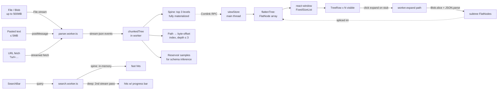
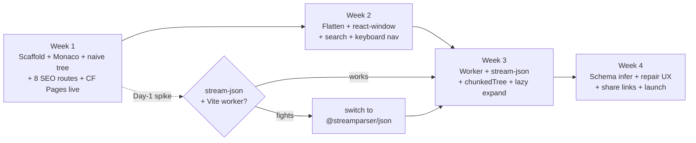

# Month 1 Implementation Plan — JSON Tool

## Context

Building the **free public JSON tool** that serves as the acquisition funnel for a paid SaaS ("reliability + observability for structured data," LLM JSON reliability as the entry wedge). 90-day company goal is 10 paying teams; Month 1's goal is a live public URL with the **huge-JSON wedge feature** working end-to-end and SEO routes indexed.

Project lives at `/Users/fazeel/Documents/json-tool/` (local; this remote planning session has no access to it). Currently contains only `PROJECT_PLAN.md` and `RESEARCH_PLAN.md`. No code, no git repo yet.

**Three locked differentiators (from PROJECT_PLAN.md):**
1. Huge-JSON handling — *Month 1 wedge*
2. Semantic diff — Month 2
3. AI grounded explanations + schema inference — schema inference Month 1, AI Month 2

**Out of scope for Month 1:** auth/accounts, paid tier UI, semantic diff, AI explanations, NL → jq, native desktop, VSCode extension, real-time collab, mobile optimization. Week 4 slack goes to perf grinding, not features.

---

## Architecture — huge-JSON path (the load-bearing piece)



**Memory rule — never violate:** never materialize a 500MB JSON to a single JS object. Spine + offset index only. Deeper nodes are `{ kind: 'lazy', byteStart, byteEnd, kindHint, childCountEstimate }` stubs in the flat list until the user expands them.

**Index size budget:** index stays <50MB on 1GB input by capping at depth 3 and array-offset granularity (every Nth element for huge arrays).

**Offset safety:** byte offsets stored in the index must land on structural token boundaries (between tokens), never inside a string or number. `Blob.slice` is byte-indexed; a mid-character UTF-8 cut produces invalid input for `JSON.parse`. Snap offsets to nearest structural boundary at index-build time, not lazy-expand time. The Day-1 spike (Week 1 Mon) tests this explicitly.

**Known future scaling risk — `FlatNode[]` memory growth:** the flat array indexed by `react-window` is a single linear buffer. If a user expands an array with 5M+ children, the array balloons even though the underlying JSON stays in the worker. Not a Month 1 problem (cap visible-expanded children at ~100k with a "show more" stub), but Month 2+ likely needs segmented flat buffers, windowed materialization, and eviction. Track in `Out of scope` until profiling shows it as the actual ceiling.

---

## Week dependency shape



Day-1 spike on `stream-json` in a Vite worker is non-negotiable — finding out it fights the bundler in Week 3 costs the wedge.

---

## Locked stack

| Layer | Choice | Reason |
|---|---|---|
| Framework | **Vite + React 18 + TS** | Better workers/WASM/Monaco story than Next.js; SEO via SSG |
| Routing | **react-router v6 (data router)** | Strong SSG ecosystem; loaders ready for Month 3 |
| SSG | **`vite-react-ssg`** | Prerenders SEO routes to static HTML at build time |
| Styling | **Tailwind + shadcn/ui + Radix** | Matches existing repo patterns |
| State | **Zustand + Immer** | Lightweight; workers can subscribe |
| Editor | **Monaco** via `@monaco-editor/react` | Lazy-loaded; not on SEO routes |
| Virtualization | **react-window `FixedSizeList`** over flat array | Simpler than VariableSizeList; rows fixed at 24px |
| Streaming parser | **`stream-json`** in web worker | Battle-tested; fallback `@streamparser/json` |
| JSON repair | **`jsonrepair`** | Best-in-class OSS; wrap with diff UX |
| Worker RPC | **`comlink`** | Ergonomic boundary |
| PM / Node | **npm** / **20 LTS (.nvmrc)** | Matches user's other repos |
| Hosting | **Cloudflare Pages** + Workers/KV (share links only) | Bandwidth economics for sample files |
| Analytics | **Plausible** | Privacy-friendly, matches "100% client-side" pitch |
| Tests | **Vitest + Playwright** (smoke only) | Unit for pure logic, ~2 E2E days max |
| Backend Month 1 | **None** beyond CF Worker + KV for share links | Postgres/Bun deferred to Month 2 |

**Locked defaults for deferred questions** (push back if any are wrong):

- Repo **private** Month 1; flip public on launch day for clean commit history. OSS-the-tool decision deferred to Month 4 (when SDK ships).
- **Telemetry:** Plausible aggregates only. JSON content never leaves the browser. Events: page view, sample-load, parse-success, parse-error, repair-used, share-created, large-file-loaded-{50,200,500}MB.
- Browser floor: Chrome/Edge/Firefox/Safari latest-2.
- Auth: deferred to Month 2; Month 1 is email capture only.
- Name + domain: placeholder `jsontool.pages.dev` until **end of Week 2** — pick from 3 candidates by Fri W2 (PayloadIQ is the default from the PDF research). Register domain + GitHub org + Twitter handle same day. After W2, this blocks the OG image, HN draft, and benchmark video.
- Launch: soft-committed to end of Week 4.
- Customer discovery: 5 calls in Month 1 (not 15). Build wins on conflict.

---

## File structure to create

```
/Users/fazeel/Documents/json-tool/
├── public/
│   ├── samples/                  # small canned JSON fixtures
│   ├── og/                       # OG images per landing
│   ├── _headers                  # CF Pages: strict CSP, security headers
│   └── robots.txt
├── src/
│   ├── main.tsx
│   ├── routes.tsx                # shared by client + SSG
│   ├── App.tsx                   # layout shell
│   ├── pages/
│   │   ├── Home.tsx              # "/" — the tool itself
│   │   └── seo/
│   │       ├── JsonViewer.tsx        # /json-viewer
│   │       ├── JsonFormatter.tsx     # /json-formatter
│   │       ├── JsonValidator.tsx     # /json-validator
│   │       ├── LargeJsonViewer.tsx   # /large-json-viewer  ← wedge SEO
│   │       ├── JsonToTypescript.tsx  # /json-to-typescript
│   │       ├── JsonToZod.tsx         # /json-to-zod
│   │       └── JsonRepair.tsx        # /json-repair
│   ├── components/
│   │   ├── editor/{MonacoPane,EditorToolbar}.tsx
│   │   ├── tree/{TreeView,TreeRow,ValuePreview,PathBreadcrumb,SearchBar}.tsx
│   │   ├── layout/{AppShell,ResizablePanes,TopBar}.tsx
│   │   ├── seo/LandingTemplate.tsx
│   │   └── ui/                       # shadcn output
│   ├── workers/
│   │   ├── parser.worker.ts          # streaming parse + index build
│   │   ├── search.worker.ts
│   │   └── schema.worker.ts
│   ├── lib/
│   │   ├── json/{flattenTree,chunkedTree,pathing,format,inferSchema}.ts
│   │   ├── net/fetchUrl.ts           # URL fetch with size/type/redirect caps
│   │   ├── workers/client.ts         # Comlink wrapper
│   │   └── analytics.ts
│   ├── state/{documentStore,viewStore,prefsStore}.ts
│   ├── styles/globals.css
│   └── types/json.ts                 # JsonValue, FlatNode, ChunkedNode, LazyStub
├── tests/
│   ├── unit/                         # Vitest
│   └── e2e/                          # Playwright smoke
├── benchmarks/
│   ├── README.md
│   ├── corpus/                       # gitignored
│   ├── generate.mjs                  # synth fixtures (see "Benchmark fixture shapes" in W3)
│   └── run.mjs                       # Playwright-driven benchmark
├── .nvmrc · .env.example · .prettierrc · eslint.config.js
├── vite.config.ts · tsconfig.json · tailwind.config.ts · postcss.config.js
├── vitest.config.ts · playwright.config.ts
└── README.md
```

---

## Day-0 setup (order matters)

Vite's scaffolder refuses a non-empty directory, so the steps below are intentionally sequenced:

```bash
cd /Users/fazeel/Documents/json-tool

# 1. Vite first — scaffolds package.json, tsconfig, src/, index.html
npm create vite@latest . -- --template react-ts
echo "20" > .nvmrc

# 2. git init AFTER scaffold so the initial commit captures the template
git init && git add -A && git commit -m "chore: initial vite scaffold"

# 3. Core runtime deps
npm i react-router-dom@6 zustand@4 immer
npm i monaco-editor @monaco-editor/react
npm i react-window @types/react-window
npm i jsonrepair stream-json @streamparser/json comlink
npm i clsx tailwind-merge class-variance-authority lucide-react
npm i @radix-ui/react-dialog @radix-ui/react-dropdown-menu \
      @radix-ui/react-tooltip @radix-ui/react-tabs \
      @radix-ui/react-toast @radix-ui/react-slot
npm i react-helmet-async react-resizable-panels

# 4. Dev deps
npm i -D tailwindcss postcss autoprefixer @tailwindcss/typography
npm i -D vite-react-ssg vite-plugin-pwa
npm i -D vitest @vitest/ui jsdom @testing-library/react @testing-library/jest-dom
npm i -D playwright @playwright/test
npm i -D eslint @typescript-eslint/parser @typescript-eslint/eslint-plugin \
         eslint-plugin-react eslint-plugin-react-hooks eslint-plugin-react-refresh
npm i -D prettier prettier-plugin-tailwindcss @types/node

# 5. Tailwind, then shadcn (shadcn requires Tailwind configured)
npx tailwindcss init -p
npx shadcn@latest init
# add: button card input textarea tabs dialog dropdown-menu tooltip toast \
#      separator scroll-area badge skeleton sheet command
```

**`vite.config.ts` essentials (4 known gotchas):**

1. `worker: { format: 'es' }` — required for ES-module workers; without it, Comlink + stream-json bundling silently breaks in production.
2. Manual chunk Monaco: `build.rollupOptions.output.manualChunks: { monaco: ['monaco-editor'] }`. Otherwise it lands in the main chunk and tanks first paint on SEO routes.
3. `optimizeDeps.exclude: ['stream-json']` — pre-bundling this library mangles its CJS entrypoints. Load only inside the worker via `import` from the worker file.
4. `@monaco-editor/react` + `loader.config({ monaco })` so we use the **bundled** monaco-editor, not the CDN default. CDN default fails offline and adds an external dependency.

**`.env.example`:**
```
VITE_APP_URL=http://localhost:5173
VITE_PLAUSIBLE_DOMAIN=
VITE_BENCHMARK_MODE=0
```

**GitHub + CI:**
- Single `.github/workflows/ci.yml`: `tsc --noEmit && eslint && vitest run && playwright test --project=chromium-smoke`. Benchmarks run locally/nightly, not in CI (flaky on shared runners).
- Conventional Commits (`feat:`, `fix:`, `perf:`).

---

## Week 1 — Foundation + first deploy

Target: **live public URL by Friday.**

| Day | Task | Files |
|---|---|---|
| Mon | Scaffold + deps. Tailwind + shadcn working. `AppShell` + `ResizablePanes`. **Day-1 spike (4hr budget):** (a) `stream-json` in a Vite worker on a 50MB fixture; (b) emit `{event, byteStart, byteEnd}` per token via a counting `TransformStream`; (c) `Blob.slice(start, end) → JSON.parse` round-trips equal to the original value; (d) UTF-8 fixture with emoji/CJK at known offsets — slice boundaries never land mid-character. If any of (a–d) fails, switch to `@streamparser/json` and repeat *today*. Decision before EOD. | `App.tsx`, `components/layout/*`, `spikes/parser-offsets.ts` |
| Tue | Monaco pane: paste / drag-drop / `?url=` load handlers; format / minify / sort-keys buttons; validation feedback (line + col). **`?url=` constraints:** client-side `fetch` only (no proxy); reject `Content-Length > 100MB`; allow only `application/json` and `text/plain`; max 3 redirects; 30s abort; show source URL to user before parsing. | `components/editor/MonacoPane.tsx`, `EditorToolbar.tsx`, `lib/json/format.ts`, `lib/net/fetchUrl.ts` |
| Wed | Naive (non-virtualized) tree view; expand/collapse; JSON-path click-to-copy; type badges. Cap at first 5k nodes with truncated banner — virtualization is Week 2. | `components/tree/*`, `lib/json/pathing.ts` |
| Thu | Routing: all 8 SEO routes stubbed via `LandingTemplate`; `vite-react-ssg` prerender works locally (verify `curl` on each route shows unique `<title>` in built HTML); CF Pages project connected to GitHub. | `routes.tsx`, `pages/seo/*`, `components/seo/LandingTemplate.tsx` |
| Fri | Deploy to CF Pages; Plausible installed; OG basics; `robots.txt`, `sitemap.xml` generated at build. **`public/_headers` with strict CSP** (`default-src 'self'`; only Plausible allowed for `script-src` / `connect-src`); "100% client-side" badge in topbar with tooltip linking to the CSP. **Public URL live.** | `vite.config.ts` SSG wiring, `public/_headers`, deploy |

**Week 1 acceptance:**
- Paste 1MB JSON → formatted → tree expands.
- Cold-load <1s for `/` and SEO routes.
- All 8 SEO routes return 200 with unique `<title>` + `<meta description>` in prerendered HTML.

---

## Week 2 — Tree view + virtualization

**Architectural decision (load-bearing):** flat 1-D `FlatNode[]` indexed by visible position; expanded-set lives as `Set<string>` of JSON pointers in `viewStore`. Flattening is O(visible nodes), called only when expansion state changes. Row height fixed at 24px; long values truncated in-row, full value on click/hover.

```ts
// src/types/json.ts
type FlatNode = {
  id: number;
  path: string;                  // JSON pointer "/foo/0/bar"
  depth: number;
  key: string | number | null;
  kind: 'object'|'array'|'string'|'number'|'bool'|'null'|'lazy';
  childCount?: number;           // exact for materialized, estimate for lazy
  preview: string;               // truncated value or "{ 3 keys }"
  isExpanded: boolean;
  parentId: number | null;
  lazy?: { byteStart: number; byteEnd: number; kindHint: 'object'|'array' };
};
```

| Day | Task | Files |
|---|---|---|
| Mon | `flattenTree.ts` + `viewStore`; switch tree to flat array | `lib/json/flattenTree.ts`, `state/viewStore.ts` |
| Tue | Wire `FixedSizeList`; render `TreeRow`. Test on synthesized 1MB / 100k-node JSON | `components/tree/TreeView.tsx`, `TreeRow.tsx` |
| Wed | Search bar: filter by key/value; jump-to-match; highlight | `components/tree/SearchBar.tsx` |
| Thu | Keyboard nav (arrows, enter, /); breadcrumb; value detail drawer | `components/tree/PathBreadcrumb.tsx`, `ValuePreview.tsx` |
| Fri | Perf pass with React Profiler. `React.memo` on `TreeRow` with shallow path+expansion check. Hit 60fps on 100k visible nodes. **Verify in `vite preview`, not just `vite dev`** — StrictMode double-renders mask perf in dev. | tuning |

**Week 2 acceptance:** 10MB JSON with 200k nodes (when fully expanded) scrolls at 60fps; search returns <100ms on spine; keyboard nav round-trips without focus jank.

---

## Week 3 — Huge-JSON wedge (streaming + index)

The moat. Architecture is the mermaid above. Concrete behavior:

1. Stream bytes from `File.stream()` into the worker. Never load file as a single ArrayBuffer.
2. Worker pipes through `stream-json`. Emit events: `startObject`, `key`, `value`, `endObject`, etc. with **byte offsets** (stream-json provides these via its filter pipeline or we wrap with a counting transform).
3. Materialize the spine (top 3 levels) fully. Deeper subtrees become `lazy` FlatNodes.
4. Build `Map<path, {byteStart, byteEnd}>` for spine + every Nth array element (configurable; default N=100 for arrays >10k items).
5. On lazy-expand: `Blob.slice(byteStart, byteEnd)` → `text()` → `JSON.parse` → flatten subtree → splice into main flat array via Comlink.
6. Deep search ("value contains X") = streaming second pass with progress bar; emits hits incrementally.

| Day | Task | Files |
|---|---|---|
| Mon | Worker plumbing with Comlink; `parser.worker.ts` streams a File and emits offset-tagged events; smoke test on 50MB | `workers/parser.worker.ts`, `lib/workers/client.ts` |
| Tue | In-worker `chunkedTree` store: build spine + offset index from stream events | `lib/json/chunkedTree.ts` |
| Wed | Lazy expand: tree row → worker fetches slice → returns subtree FlatNodes; splice into flat array | TreeView wiring, worker RPC |
| Thu | Search slow path with progress; memory monitoring HUD (toggle via `?debug=1`, reads `performance.memory` when available) | `workers/search.worker.ts` |
| Fri | Benchmark on the fixture matrix below (not on a single synthesized array of objects — competitors win on synthetic JSON nobody has). Tune. Fix worst regressions. | `benchmarks/run.mjs` |

**Benchmark fixture shapes (`generate.mjs` produces all of these):**

| Shape | Size targets | Why |
|---|---|---|
| `flat-array.json` | 50 / 200 / 500MB | Baseline: array of similar objects (log-line shape). Easiest case. |
| `deep-nested.json` | 5 / 20MB | 1000+ levels deep. Tree-recursion / stack-limit stressor. |
| `wide-object.json` | 50 / 200MB | Single object with 1M+ keys. Tests key-search / Map performance. |
| `giant-array.json` | 200 / 500MB | Array with 10M+ small elements. Tests virtualization + offset-index granularity. |
| `unicode-heavy.json` | 50MB | Emoji + CJK + escape sequences at known offsets. UTF-8 slice safety. |
| `long-strings.json` | 100MB | A few values that are individually 50MB+. Tests "expand single string" UX. |
| `telemetry.json` | 200MB | Realistic mixed shape: timestamps, IDs, nested events, nulls, sparse fields. Closest to user reality. |
| `pathological.json` | 50MB | Repeated keys (RFC-allowed), trailing-comma-adjacent, escaped quotes, BOM. Robustness. |

Competitor benchmark video uses `telemetry.json` (most realistic) + `flat-array.json` (most flattering) so head-to-head numbers are honest.

**Realistic ceilings — be honest:**

| Target | Probability | Public claim |
|---|---|---|
| 50MB instant | 95% | Yes |
| 200MB smooth | 80% | Yes |
| 500MB usable (indexed, progress bar) | 55–65% | **Lead the launch with this** |
| 1GB streamed | 20–30% | **Internal stretch only — never in public copy, OG image, HN post, or SEO landings.** HN commenters will test pathological GB files to break it; don't give them the target. |

Launch narrative: **"500MB JSON in your browser. In 30 seconds. Without crashing."**

**Public-claim ceiling:** 500MB. All marketing surfaces (`/large-json-viewer` hero, OG image, HN title, benchmark video voiceover, screenshot captions) stop at 500MB. 1GB performance is internal benchmarking only.

**Pre-bake both narratives by Fri W3** (no panic drafting on launch day):
- **A-narrative (500MB hits):** "500MB JSON in your browser, in 30s, without crashing." HN post, OG image, benchmark video.
- **B-narrative (500MB only indexed-mode):** "200MB smooth; 500MB indexed-and-searchable." Pivot decision is end-of-W3, based on benchmark numbers — not launch day.

**Cut order if W3 slips** (in order of removal, not addition):
1. **Schema inference Tab in the UI** — keep the worker code; just don't surface it. AI explanations are M2 anyway; Zod export is not the launch hook.
2. **JSON-repair diff UX** — ship `jsonrepair` as a one-click button without the "we fixed X / Y / Z" diff view.
3. **Do NOT cut:** share links (HN traffic depends on it), benchmark video (the launch hook itself), Lighthouse 90+ on `/large-json-viewer`.

---

## Week 4 — Schema/repair/share + launch

| Day | Task | Files |
|---|---|---|
| Mon | Schema inference (`schema.worker.ts`): walk spine + reservoir; emit JSON Schema / TS interface / Zod. Roll our own — don't pull `quicktype` (~1MB). **Bounded scope (in-scope):** primitive types, arrays, object structure, nullable detection. **Explicitly out (Month 2+):** union inference, enum inference, recursive merging across siblings, format detection (date/email/UUID), reference detection. Schema spirals fast — keep the surface small or it eats W4. | `workers/schema.worker.ts`, `lib/json/inferSchema.ts` |
| Tue | JSON repair UX: wire `jsonrepair`; show "we fixed X / Y / Z" diff before applying | `components/editor/EditorToolbar.tsx` |
| Wed | SEO landing copy: hero, "open with your file", benchmark table with screenshots, three-differentiator sections. TSX with prose Tailwind, no MDX. | `pages/seo/*` |
| Thu | Email capture (CF Worker → KV); shareable links (Worker + KV; gzipped JSON ≤1MB; ~30 LoC); Plausible custom events firing | new CF Worker, `lib/analytics.ts` |
| Fri | **Launch prep:** record benchmark video against jsonhero / stack.hu / jsoncrack / jsoneditoronline on the same fixture; draft HN post; Show HN dry run with 2 friends; polish; ship. Flip repo public. | recordings, post drafts |

**Budget rule:** treat competitor benchmark recording as a full-day task. Rushing it the night before kills the hero claim.

---

## Parallel ops (run alongside build — not optional)

These are off-keyboard tasks that validate the strategic bet. Skipping them means hitting M3 with no validation. Block them into the calendar; they slip silently otherwise.

| Track | When | Budget | What |
|---|---|---|---|
| **Customer calls** | Tue + Thu afternoons, W2–W3 | 5 calls (not 15) | Recruiting takes 2 weeks lead time — draft cold-email + Twitter DM templates by Fri W1. Outreach starts W1, not W3. Target 5 booked, accept 3, don't slip the launch. |
| **Conversion experiment (cold email)** | Start W1, results by end W2 | $200 + 50 messages | DM/email founders of recent YC batches with AI products. Pitch: "monitoring for LLM JSON outputs, 20-min call?" Track reply rate + "would pay" rate. Tells us whether SDK demand exists *independently* of free-tool conversion. <5% reply rate or <2/10 "would pay" → wedge needs rethink, in Week 2, not Month 3. |
| **Native structured output disruption test** | W2 evening, 2hr | 5 schemas, GPT-4o strict mode | Force semantic-not-syntactic failures (ambiguous enums, edge cases). Document what slips through. If >50% of failures are semantic/drift → wedge holds. If <20% → pivot toward API-payload-drift angle now. |
| **Launch narrative A/B drafts** | Fri W3 | half-day | Both HN drafts written, OG images for both, video script for both. Pivot decision based on W3 benchmark numbers, not launch-day panic. |
| **`vite preview` perf check** | Every Friday | 30 min | StrictMode in `vite dev` masks regressions. Catching them weekly avoids launch-day surprises. |

---

## Testing strategy (~2 days total)

| Layer | Test? | Coverage |
|---|---|---|
| Unit (Vitest) | Yes, narrow | `flattenTree`, `pathing` (JSON Pointer encode/decode), `inferSchema` |
| Worker contract | Yes | Worker emits expected events on known fixtures — catches silent parser-lib upgrades |
| E2E (Playwright) | Yes, smoke | 5 tests: homepage → paste sample → tree renders → expand → copy path |
| Benchmarks | Local/nightly only | Not in CI. Run before launch + weekly. |
| Accessibility | Partial | Keyboard nav for tree; focus mgmt in dialogs; one axe test |
| Component (RTL) | Skip | Snapshot tests of tree rows aren't worth the time |
| Visual regression | Skip | Manual review fine at this size |

---

## Risks (ranked by likelihood)

| Risk | Likelihood | Impact | Mitigation |
|---|---|---|---|
| `stream-json` fights Vite worker bundling | High | 2-day slip | Spike Day 1 W1. Fall back to `@streamparser/json` immediately. |
| Byte-offset emission unreliable / UTF-8 mid-character cuts | Medium | Lazy-expand chain breaks entirely | Day-1 spike tests (b)+(c)+(d) explicitly. Snap offsets to structural boundaries at index-build time. If both parsers fail offset emission, fall back to "full-spine, no lazy expand" — caps usable size at ~150MB but still ships. |
| 500MB benchmark misses | Medium | Launch narrative weakens | Pre-bake A/B narratives by Fri W3. Pivot decision is data-driven end of W3, not panic at launch. |
| Monaco bloats first paint >3s | Medium | SEO + UX hit | Lazy-load Monaco; textarea fallback first paint; SEO pages don't load Monaco. |
| Tree perf dies in `vite preview` despite OK in `vite dev` | Medium | Late surprise | `vite preview` perf check every Friday (Parallel ops). |
| Pulled into M2 features (semantic diff, AI) | High | Wedge weakens | Hard rule: nothing from M2 ships in M1. Slack → perf. Cut order (in W3 section) decides what goes first if time tightens. |
| SEO indexing takes 4–8 weeks | High | No M1 SEO traffic | Acceptable. M1 traffic = HN/Twitter; SEO compounds M2–M3. |
| Customer-call recruiting lead time underestimated | High | 0 calls instead of 5 | Outreach in W1, not W3. Templates drafted by Fri W1. 2-week lead time is non-negotiable. |
| **Free-tool → paid-SDK conversion is untested and load-bearing** | High | Free tool gets traffic, paid product gets no leads | Cold-email experiment in W1 validates SDK demand *independently* of free-tool funnel. <5% reply or <2/10 "would pay" → wedge rethink in W2. |
| **Native structured output disruption** (OpenAI strict, Anthropic tool use) | Medium (12-mo horizon) | Entry wedge evaporates | W2 evening test: induce semantic failures in GPT-4o strict mode. If <20% slip through, pivot wedge toward API-payload-drift now, not in M3. |
| Domain / name decision drags past W2 | Medium | Blocks OG image, HN draft, benchmark video | Pick from 3 candidates by Fri W2; register domain + GitHub + Twitter same day. |

---

## Verification — definition of done for Month 1

Binary checklist (no "mostly"):

- [x] **Day-1 spike (2026-05-14):** parser locked = `@streamparser/json`. (a) bundles in Vite ES-module worker ✓. (b)+(c)+(d) all pass on ASCII + UTF-8 builtin fixtures ✓. 50MB telemetry fixture: parser handles correctly (fires onValue for top-level `events`); spike's placeholder string-search offset recovery confirmed unviable on formatted JSON (expected) — **production offset capture must use `@streamparser/json`'s `Tokenizer.onToken` (per-token byte offsets), not high-level `onValue` + string-search**. Captured as W3 priority. Two implementation notes: do NOT call `parser.end()` when input is complete (auto-finalizes; second call throws); snap captured offsets to structural token boundaries per the Offset-safety rule in Architecture.
- [ ] Public URL live (CF Pages or custom domain)
- [ ] Name picked, domain + GitHub org + Twitter handle registered (by Fri W2)
- [ ] Paste 1MB JSON → format → tree expands smoothly
- [ ] 200MB JSON loads, renders spine, can navigate top 3 levels
- [ ] 500MB JSON loads in <60s with progress bar, can navigate spine, search works in slow path
- [ ] Schema inference exports JSON Schema, TS, Zod from a 1MB JSON
- [ ] `jsonrepair` fixes a deliberately-broken LLM JSON sample
- [ ] All 8 SEO routes return 200 with unique `<title>`/`<meta>` in prerendered HTML
- [ ] `public/_headers` CSP verified live (only Plausible allowed; CSP visible in browser devtools)
- [ ] `?url=` handler enforces 100MB cap, content-type allowlist, 3-redirect max, 30s abort
- [ ] Sitemap submitted to Google Search Console
- [ ] Plausible firing events: page views, parse-success, parse-error, repair-used, large-file-loaded-{50,200,500}
- [ ] Email capture working (CF Worker → KV)
- [ ] Shareable links working (gzip + KV)
- [ ] Benchmark video recorded vs jsonhero / stack.hu / jsoncrack / jsoneditoronline
- [ ] **Both A and B launch narratives drafted** (HN post + OG + video script) by Fri W3
- [ ] 5 strangers gave recorded feedback; ≥3 found a real bug/UX issue
- [ ] **Parallel-ops outcomes recorded:** customer-call notes (≥3), cold-email reply/pay rates, native-structured-output test result
- [ ] Lighthouse 90+ on `/`, `/json-viewer`, `/large-json-viewer`
- [ ] CI green: `tsc && eslint && vitest && playwright smoke`
- [ ] Repo flipped public on launch day

**Verification commands:**

```bash
# Build + verify all SEO routes have unique titles
npm run build
npx serve dist &  # or: npm run preview
for route in / json-viewer json-formatter json-validator large-json-viewer \
             json-to-typescript json-to-zod json-repair; do
  echo "--- /$route ---"
  curl -s "http://localhost:4173/$route" | grep -E "<title>|<meta name=\"description\""
done

# CI
npm run typecheck && npm run lint && npm run test && npm run test:e2e

# Benchmarks (manual)
node benchmarks/generate.mjs --size 500
node benchmarks/run.mjs --fixture corpus/500mb.json
```

---

## Out of scope (Month 1) — deferred decisions

Decided as they come up, not pre-committed:

- Brand name + custom domain (placeholder OK)
- Open-source the free tool itself (default: closed Month 1; revisit Month 4)
- Sample-file CDN hosting cost cap
- Switch from `react-window` to `@tanstack/react-virtual` (revisit Month 2 if perf walls)
- Switch from `stream-json` to `simdjson-wasm` for medium files (revisit Month 2)
- Auth/Clerk integration (Month 2)
- Postgres/Bun backend (Month 2)
- Customer discovery calls beyond 5 (Month 2 picks up the rest)